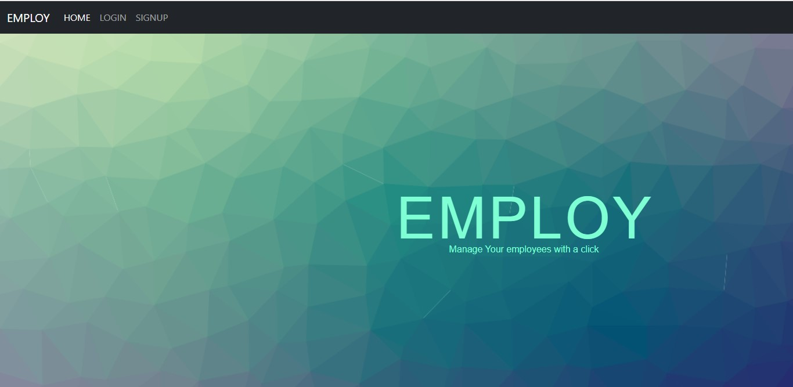
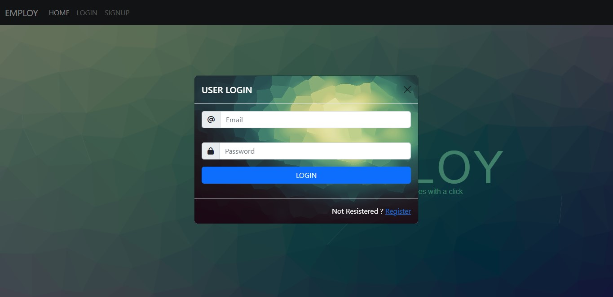
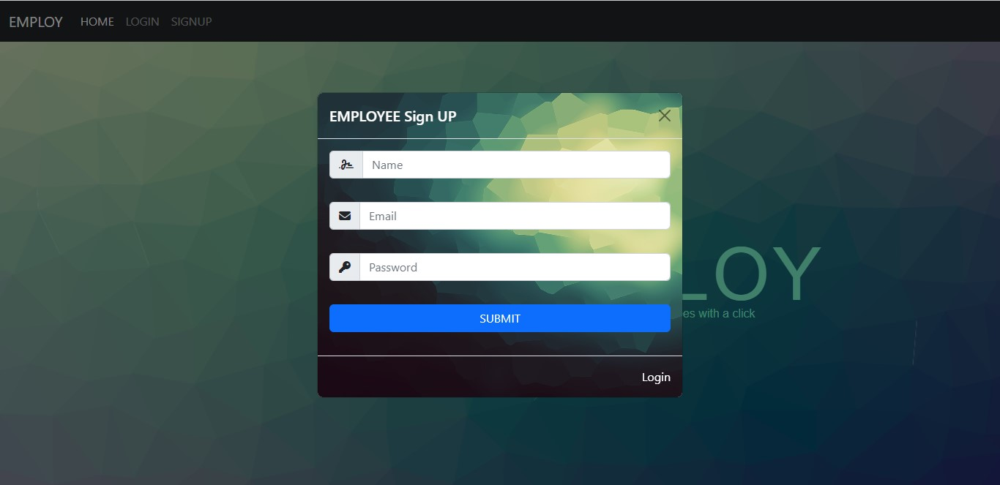
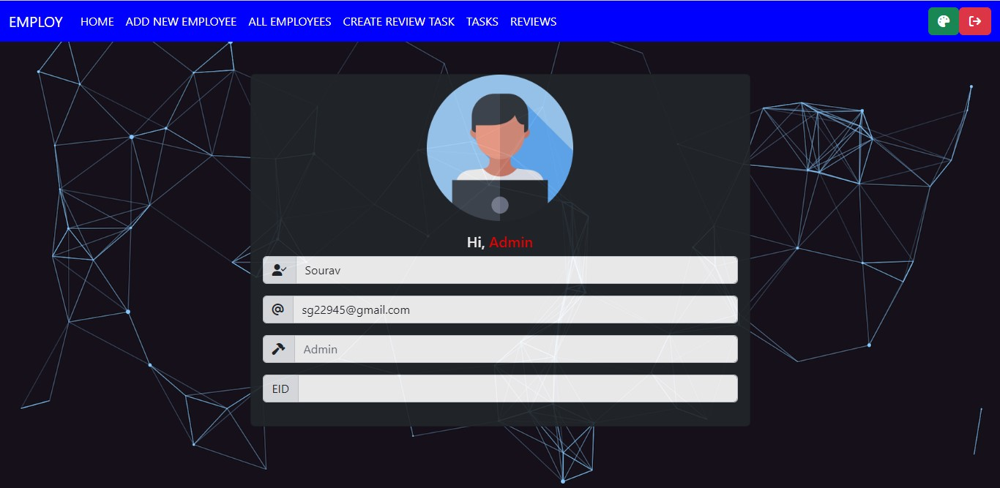
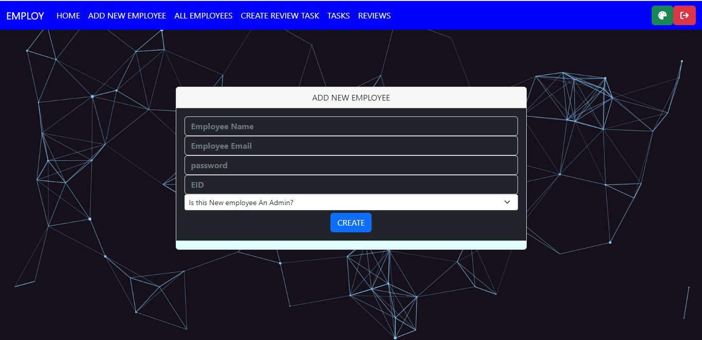
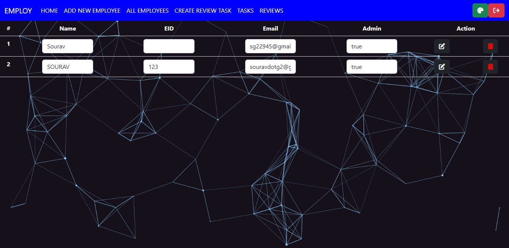
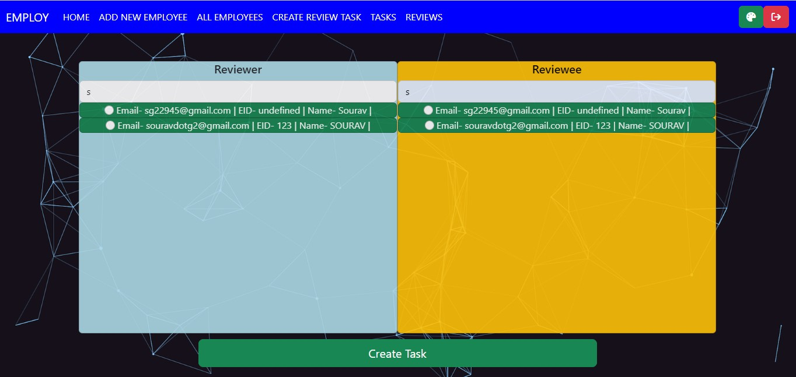
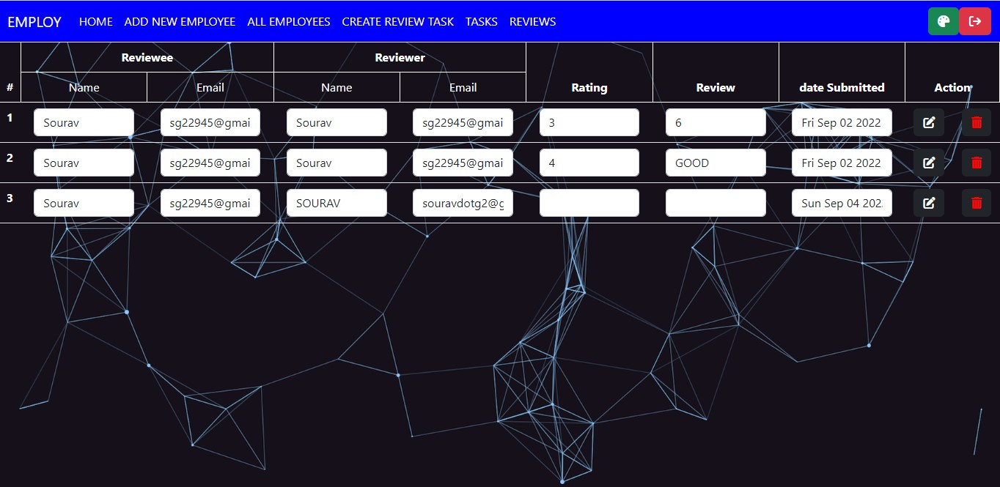
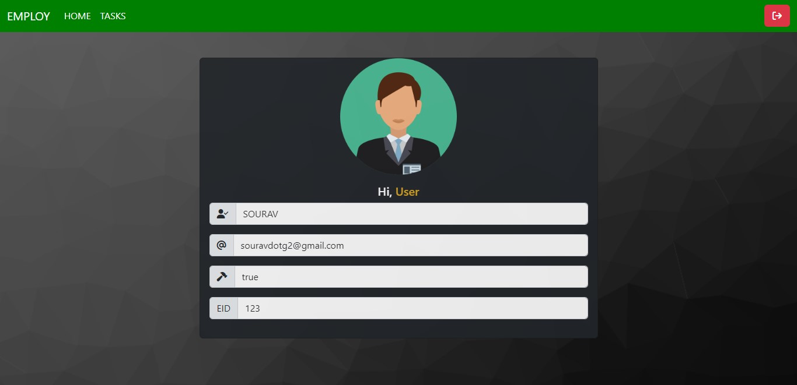
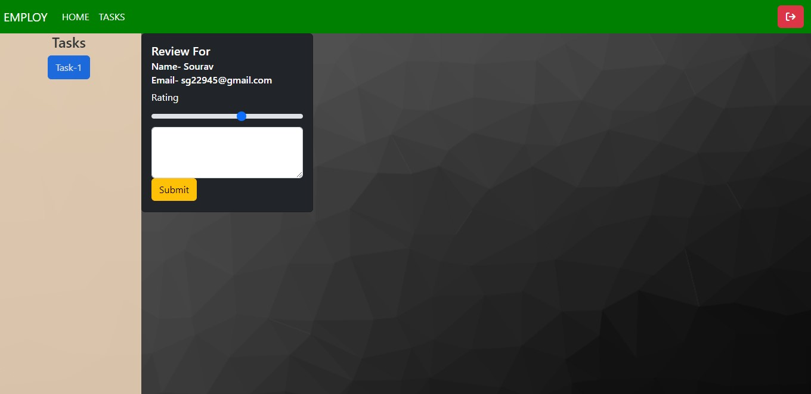

# EMPLOY - Employee Review System
A Employee Review System app where employees can submit reviews towards each other.

## dependencies:
connect-mongo, mongoose, cookie-parser, dotenv, ejs, express, express-ejs-layouts, express-session, nodemon, noty,connect-flash,2

## Tech Stack:
- Node JS
- Express JS
- Mongo DB
- HTML, CSS
- Heroku

## Features
- Employees can sign ij using their username, password and email.
- By default employee is not admin.
- An admin can set an employee as admin.
- Admin can
    - View profile 
    - Make an employee admin
    - Add new employee
    - View all employee details
    - Edit Employee Details
    - Add review task (by searching name of memployees)
    - View all task
    - Edit review tasks
    - Change theme of page
    - Submit own task


# Directory Structure

```
├── README.md
├── assets
│   ├── css
│   │   ├── admin_create_task.css 
│   │   ├── admin_layout.css      
│   │   ├── home.css
│   │   ├── home_animation.css    
│   │   ├── layout.css
│   │   └── layout_employee.css   
│   ├── images
│   │   ├── admin.png
│   │   └── user.png
│   └── js
│       ├── admin_all_reviews.js  
│       ├── admin_create_task.js  
│       ├── admin_employee_view.js
│       ├── admin_layout.js       
│       └── home.js
├── config
│   ├── flashMiddleware.js
│   ├── mongoose.js
│   └── passport-local.js
├── controllers
│   ├── admin-controller.js
│   ├── home-controller.js
│   ├── review-controller.js
│   └── user-controller.js
├── index.js
├── models
│   ├── Review.js
│   └── User.js
├── package-lock.json
├── package.json
├── routers
│   ├── admin.js
│   ├── index.js
│   ├── review.js
│   └── user.js
└── views
    ├── _admin_addemployee.ejs
    ├── _admin_employee_view.ejs
    ├── _admin_header.ejs
    ├── _employee_header.ejs
    ├── _footer.ejs
    ├── _header.ejs
    ├── _user_task_view.ejs
    ├── admin_all_reviews.ejs
    ├── admin_create_task.ejs
    ├── admin_layout.ejs
    ├── admin_profile.ejs
    ├── employee_layout.ejs
    ├── employee_profile.ejs
    ├── home.ejs
    └── layout.ejs

```
## Features with details
<ol>
 <li><h3>Homepage</h3>
 <ul>
    <li><h4>home</h4>
    
    </li>
    <li><h4>login</h4>
    
    </li>
    <li><h4>signup</h4>
    
    </li>
 </ul>
 </li>
 <li><h3>ADMIN View</h3>
 <ul>
    <li><h4>Profile</h4>
    
    </li>
    <li><h4>Add employee</h4>
    
    </li>
    <li><h4>View all employee</h4>
    
    </li>
    <li><h4>Create review task</h4>
    
    </li>
    <li><h4>View own task</h4>
    
    </li>
    <li><h4>View all task and edit task</h4>
    
    </li>

 </ul>
 </li>
  <li><h3>Employee View/ Non Admin View</h3>
 <ul>
    <li><h4>View Profile</h4>
    
    </li>
    <li><h4>View Tasks and submit </h4>
    
    </li>
 </ul>
 </li>
</ol>

  
## Git Clone
To use this repository in your local system-

<a href="https://github.com/CoderOnTheRoad/Employee-Review-System-App-EMPLOY.git" target="_blank">https://github.com/CoderOnTheRoad/Employee-Review-System-App-EMPLOY.git</a>

or run this command in your GitHub CLI

###### `gh repo clone CoderOnTheRoad/Employee-Review-System-App-EMPLOY`
<br>


## <a href = "https://employee-review-system-employ.herokuapp.com/" target="_blank"> Demo / Hosted on - https://employee-review-system-employ.herokuapp.com/</a>


